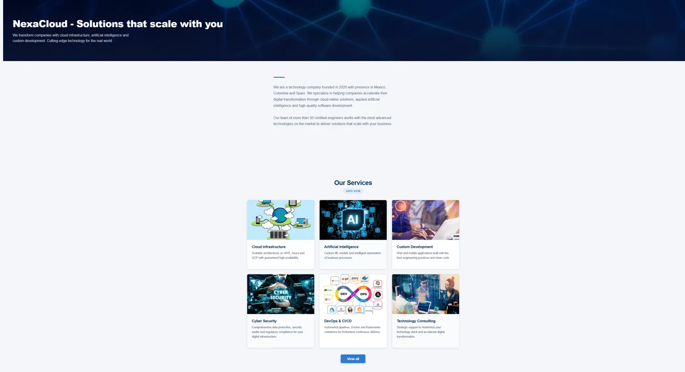

# Prueba Técnica — Adobe Experience Manager (AEMaaCS)

Repositorio desarrollado como parte de una prueba técnica para Adobe AEM as a Cloud Service.

## ⚙️ Stack y Entorno

| Herramienta | Versión |
|---|---|
| Java | **21** (requerido por el SDK local utilizado) |
| Maven | 3.9+ |
| AEM SDK | AEMaaCS Quickstart `.jar` (Author local) |
| Node.js | 18+ (para `ui.frontend`) |
| AEM Core Components | v3 |

> **Nota sobre Java:** Aunque la especificación de la prueba indica Java 17, este proyecto utiliza **Java 21** debido a compatibilidad con la versión del AEMaaCS SDK instalada localmente. El código es completamente compatible y no utiliza APIs exclusivas de versiones posteriores a Java 17.

## 📁 Estructura del Proyecto

```
mi-proyecto/
├── core/               # Sling Models, Servlets (Java)
├── ui.apps/            # Componentes HTL, definiciones JCR, i18n
├── ui.content/         # Contenido de ejemplo, Templates, XF
├── ui.config/          # Configuraciones OSGi
├── ui.frontend/        # SCSS, webpack, assets
└── all/                # Paquete unificado para despliegue
```

## 🧩 Componente Principal: `card-list-showcase`

Componente personalizado que hereda de `wcm/foundation/components/responsivegrid`, diseñado para demostrar dominio de:

- **HTL / Sightly** — `data-sly-use`, `data-sly-list`, `data-sly-test`, `data-sly-template`, `data-sly-call`
- **Contextos de escape XSS** — `@context='text'`, `@context='html'`, `@context='uri'`, `@context='attribute'`
- **i18n** — `${'Texto' @ i18n}` con diccionarios EN/ES en `/apps/mi-proyecto/i18n/`
- **Sling Models** — interfaz + implementación con `@Self`, `@ValueMapValue`, `@ChildResource`
- **Servlet OSGi R7** — registrado por path `/bin/holafuturo`
- **Variables de loop HTL** — `index`, `count`, `first`, `last`, `odd`, `even` demostradas explícitamente
- **Editable Templates** en `/conf/mi-proyecto/`
- **Experience Fragment** — `NexaCloud Services` bajo `/content/experience-fragments/mi-proyecto/`

### Estructura del diálogo (Multifield composite)

```
_cq_dialog/
└── .content.xml
    └── multifield: ./cards
        └── items:
            ├── cardTitle       (textfield)
            ├── cardDescription (textarea)
            ├── cardImage       (pathfield → /content/dam)
            └── cardLink        (pathfield)
```

### Endpoint del Servlet

```
GET http://localhost:4502/bin/holafuturo
→ {"status":"ok","message":"Hola Futuro!","cards":[]}
```

## 🌐 Internacionalización (i18n)

El componente soporta inglés y español mediante diccionarios registrados en:

```
/apps/mi-proyecto/i18n/
├── en.json   # English translations
└── es.json   # Spanish (keys = values)
```

Textos traducidos: `Ver todos`, `Vista: Cuadrícula`, `Vista: Lista`, `No hay tarjetas disponibles`, `Leer más`.

## 🎨 Frontend y Estilos

El proyecto utiliza webpack + SCSS con arquitectura BEM:

- `_card-list-showcase.scss` — estilos del componente principal (grid/lista, modal, botón)
- `_teaser.scss` — hero con imagen de fondo y texto superpuesto (estilo `cmp-teaser--hero`)
- `_navigation.scss` — navegación horizontal corporativa con dropdown
- `_languagenavigation.scss` — selector de idioma EN/ES fixed en header
- `_text.scss` — sección "Sobre nosotros" centrada con acento visual
- `_base.scss` — variables y reset global

### Paleta corporativa (NexaCloud)

| Variable | Color |
|---|---|
| Primary | `#1a3a5c` |
| Accent | `#2d7dd2` |
| Background | `#f4f6f9` |
| Text muted | `#5a6a7e` |

## 📄 Páginas creadas

| URL | Idioma | Descripción |
|---|---|---|
| `/content/mi-proyecto/us/es/en.html` | Español | Página principal NexaCloud |
| `/content/mi-proyecto/us/en/en1.html` | Inglés | Versión en inglés |

Ambas páginas incluyen: Hero Teaser, sección "Sobre NexaCloud" y Card List Showcase con 6 servicios.

## 🖥️ Requisitos Previos

Antes de compilar y desplegar el proyecto asegúrate de tener instalado y configurado lo siguiente:

1. **Java 21** — [Descargar](https://adoptium.net/)
2. **Maven 3.9+** — [Descargar](https://maven.apache.org/download.cgi)
3. **Node.js 18+** — [Descargar](https://nodejs.org/)
4. **AEM SDK** — Quickstart `.jar` de AEMaaCS (proporcionado por Adobe)

## ▶️ Cómo correr el proyecto

### 1. Iniciar AEM Author local

```bash
# Crear una carpeta para AEM y copiar el Quickstart .jar ahí
mkdir aem-author && cd aem-author

# Iniciar AEM en modo Author en el puerto 4502
java -jar aem-quickstart.jar -r author -p 4502
```

Espera a que AEM inicie completamente. Puedes verificarlo accediendo a:
```
http://localhost:4502
```
Credenciales por defecto: `admin / admin`

### 2. Instalar el paquete de contenido (opción rápida)

Si prefieres no compilar desde el código fuente, instala directamente el `.zip` adjunto:

1. Ve a `http://localhost:4502/crx/packmgr/index.jsp`
2. Clic en **Upload Package** y selecciona el archivo `.zip`
3. Una vez subido, clic en **Install**
4. Accede a las páginas en:
   - Español: `http://localhost:4502/content/mi-proyecto/us/es/en.html`
   - Inglés: `http://localhost:4502/content/mi-proyecto/us/en/en1.html`

### 3. Compilar e instalar desde el código fuente

```bash
# Clonar el repositorio
git clone <url-del-repositorio>
cd mi-proyecto

# Compilar e instalar todo el proyecto
mvn clean install -PautoInstallSinglePackage
```

> Asegúrate de que AEM Author esté corriendo en `http://localhost:4502` antes de ejecutar el comando.

## 🚀 Comandos de Compilación

```bash
# Compilar e instalar todo el proyecto
mvn clean install -PautoInstallSinglePackage

# Solo el backend (core)
mvn clean install -pl core

# Solo ui.apps
mvn clean install -pl ui.apps -PautoInstallPackage
```

> **Nota:** El módulo `ui.tests` está comentado en el `pom.xml` raíz para evitar errores de permisos de Windows con `node_modules` en entorno local. Los Cypress tests están diseñados para ejecutarse en el pipeline de Cloud Manager, no localmente.

## ⚠️ Decisiones Técnicas y Limitaciones Conocidas

### 1. `name="./cards"` en el `<field>` interior del Composite Multifield

El nodo `<field>` (container interior del multifield) conserva `name="./cards"`, lo cual difiere de la especificación estándar de Granite UI donde el container interior no debería tener `name`.

Esta decisión fue tomada de forma deliberada tras validación en CRXDE: al remover el atributo, el diálogo deja de persistir los subnodos `cards/item0`, `cards/item1` correctamente en el JCR. Con el atributo presente, la estructura se guarda correctamente y el Sling Model la lee sin problemas.

La estructura JCR resultante es la esperada:

```
card_list_showcase/
└── cards/
    ├── item0/
    │   ├── cardTitle
    │   ├── cardDescription
    │   ├── cardImage
    │   └── cardLink
    └── item1/
        └── ...
```

### 2. `context='text'` en lugar de `context='html'` para `cardDescription`

El campo `cardDescription` usa un `textarea` (texto plano) en lugar de un RTE (Rich Text Editor), por incompatibilidad del componente `richtext` de Granite UI dentro de un composite multifield en esta versión del SDK.

Como consecuencia, en el HTL se utiliza `context='text'` en lugar de `context='html'`, lo cual es el contexto correcto y más seguro para texto plano. Si el evaluador requiere `context='html'`, el campo debería migrarse a un RTE con sanitización AntiSamy.

### 3. `data-sly-list` en `<sly>` wrapper en lugar de en el `<li>`

El multifield genera subnodos bajo `cards/item0`, `cards/item1`, etc. Al colocar `data-sly-list` directamente en el `<li>`, AEM agrupaba todos los items dentro de un solo `<li>`. La solución fue envolver el `<li>` en un `<sly data-sly-list>`, lo cual itera correctamente generando un `<li>` por cada card.

### 4. `CardListServlet` — registro por path vs resourceType

El servlet usa `@SlingServletPaths(value = "/bin/holafuturo")` para cumplir el requisito literal de la prueba. En un proyecto AEMaaCS real se usaría `@SlingServletResourceTypes` ya que `sling.servlet.paths` está bloqueado por defecto en AEM as a Cloud Service por razones de seguridad.

## 📸 Vista previa

### Español


### Inglés


## 👤 Autor

**Fernando**
Prueba técnica — AEM Developer